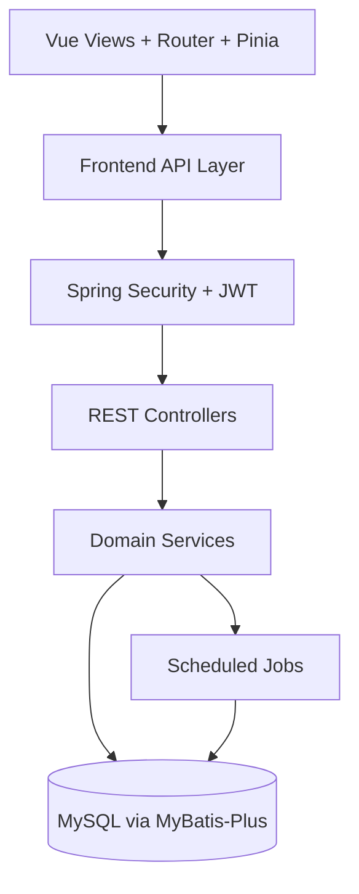

# Design Document

## Overview

社区志愿服务平台基于现有前后端分离工程，采用“稳定主链路 + 渐进式治理”设计策略：在不破坏当前可运行能力的前提下，围绕身份鉴权、活动生命周期、内容社区、统计看板与仓库治理五个域持续补齐需求差距。  
本设计覆盖 `.spec-workflow/specs/community-volunteer-service-platform/requirements.md` 的全部需求，重点强调三类设计原则：

- 保持后端统一返回契约（`ApiResponse` + `PageResult`）和角色鉴权边界。
- 保持前端页面能力复用优先（`useTable`、`useSelectionIds`、`runConfirmedAction` 等）。
- 保持迭代可交付性（构建、编译、冒烟验证可重复执行，规格与文档同步更新）。
- 必须优先并积极使用 skill，将 skill 作为排查问题、浏览器联调、验证、文档处理和交付核查的默认入口；只要存在匹配 skill，就不能回避或被动使用。

## Steering Document Alignment

### Technical Standards (tech.md)

当前 `.spec-workflow/steering/` 未提供 `tech.md`，本设计按仓库既有技术基线执行并固化约束：

- 后端维持 `Java 21 + Spring Boot 3.5 + Spring Security + JWT + MyBatis-Plus`。
- 前端维持 `Vue 3 + TypeScript + Vite + Element Plus + Pinia + Vue Router`。
- 接口风格继续以 REST 为主，统一走 `/api/*` 命名空间，不引入并行风格（如 GraphQL）。
- 错误处理继续通过后端统一异常处理器返回可读业务错误，不在前端硬编码业务真相。

### Project Structure (structure.md)

当前 `.spec-workflow/steering/` 未提供 `structure.md`，本设计对齐仓库事实结构并限制结构漂移：

- `backend/` 聚焦 API、业务服务、数据访问、调度任务。
- `Frontend/` 聚焦页面、API 封装、复用组合式能力、状态管理。
- `.spec-workflow/specs/` 作为规格主入口，`file/` 作为过程文档与治理记录入口。
- 禁止重新引入与主链路无关的并行模板副本目录。

## Code Reuse Analysis

现有代码已具备较完整业务骨架，本轮设计以复用和收敛为先，不做大规模推倒重建。

### Existing Components to Leverage

- **`Frontend/src/composables/useTable.ts`**: 统一分页查询、loading 状态、翻页和重置行为，所有列表页优先复用。
- **`Frontend/src/composables/useSelectionIds.ts`**: 统一表格多选 ID 管理，减少页面局部重复逻辑。
- **`Frontend/src/utils/confirmed-action.ts`**: 统一危险操作确认、成功提示和后置刷新链路。
- **`Frontend/src/utils/request.ts`**: 统一请求拦截、鉴权注入、响应解包与异常提示。
- **`backend/common/web/ApiResponse` + `PageResult`**: 统一接口返回模型和分页契约。
- **`ActivityService` / `ContentService` / `UserService` / `AuthService`**: 作为现有核心服务域，先做职责内增量演进，再视体量拆分子服务。
- **`ActivityScheduleTask` + `VolunteerWeeklyStatsService`**: 复用现有定时治理任务能力处理活动过期和周榜生成。

### Integration Points

- **认证与权限**: `AuthController` + `SecurityConfig` + JWT 过滤链负责登录签发与接口保护，前端路由和请求层消费 token 与角色信息。
- **活动与报名链路**: `ActivityController`/`ActivityService` 与前端 `src/api/activity.ts`、活动相关页面联动。
- **内容与论坛链路**: `ContentController`/`ContentService` 与前端 `src/api/content.ts`、门户和管理页面联动。
- **统计与看板链路**: `DashboardController`/`DashboardService`/`VolunteerWeeklyStatsService` 与前端 `src/api/dashboard.ts` 联动。
- **文件上传链路**: `CommonController` 与前端上传组件结合，统一文件类型和大小边界。

## Architecture

整体采用“前端 BFF-less 直连后端 REST + 后端分模块服务”的分层结构：

1. 前端页面层（Views）只组织交互和展示，不直接拼接持久化逻辑。
2. 前端 API 层（`src/api/*`）封装请求参数和返回类型。
3. 后端 Controller 负责输入校验、角色约束和响应封装。
4. 后端 Service 负责业务规则、事务边界和多表编排。
5. 持久化层（Mapper/Entity）负责数据库访问。
6. 调度层负责周期性治理任务，与在线请求解耦。

### Modular Design Principles

- **Single File Responsibility**: 单文件只承载一个主职责；超大服务优先按领域动作拆分为协同服务。
- **Component Isolation**: 前端页面优先复用 composable 与 util，避免散落式重复脚本。
- **Service Layer Separation**: Controller 不写业务细节，Service 不承载 HTTP 语义。
- **Utility Modularity**: 鉴权、分页、选择、确认、上传校验保持独立模块。



## Components and Interfaces

### Authentication and Workspace Routing
- **Purpose:** 提供登录、鉴权、角色入口分流与登出闭环。
- **Interfaces:** `POST /api/auth/login`、`POST /api/auth/register`、前端路由守卫与 token 存储清理。
- **Dependencies:** `AuthService`、`SecurityConfig`、前端 `auth.ts` 和状态存储。
- **Reuses:** `request.ts` 统一请求与错误处理机制。

### Activity Domain Module
- **Purpose:** 管理活动分类、活动 CRUD、报名审核、签到签退、个人记录。
- **Interfaces:** `/api/activity/categories`、`/api/activity/page`、`/api/activity/apply/{id}`、`/api/activity/sign-in`、`/api/activity/sign-out` 等。
- **Dependencies:** `ActivityService`、活动/报名/签到相关数据表。
- **Reuses:** 前端 `useTable` + `useSelectionIds` + `runConfirmedAction`。

### Content and Community Module
- **Purpose:** 管理动态、公告、轮播、论坛、评论和收藏能力。
- **Interfaces:** `/api/content/*` 下分页、审核、评论、收藏相关接口。
- **Dependencies:** `ContentService`、论坛与内容相关表结构。
- **Reuses:** `ContentManageView` 的按标签增量加载策略、统一确认操作工具。

### Dashboard and Weekly Ranking Module
- **Purpose:** 提供管理员看板、志愿者周榜查询与重建。
- **Interfaces:** `GET /api/dashboard/admin`、`GET /api/dashboard/weekly-ranking`、`POST /api/dashboard/weekly-ranking/rebuild`。
- **Dependencies:** `DashboardService`、`VolunteerWeeklyStatsService`、定时任务。
- **Reuses:** 现有周统计 SQL 生成逻辑与调度任务入口。

### Governance and Delivery Module
- **Purpose:** 保证规格、审批、文档、验证命令形成闭环。
- **Interfaces:** `.spec-workflow/specs/*` 文档资产；`scripts/local-approval.ps1` 审批工具。
- **Dependencies:** `.approval-workflow/` 审批记录、`file/` 治理文档。
- **Reuses:** 已建立的聊天审批 + 本地落档流程，以及基于 skill 的验证与交付流程。

## Data Models

### Activity Lifecycle Aggregate
```text
Activity
- id: Long
- categoryId: Long
- title: String
- description/content: String
- coverImage: String
- address: String
- volunteerQuota: Integer
- targetCount: Integer
- startTime: LocalDateTime
- endTime: LocalDateTime
- status: String (DRAFT/PUBLISHED/ENDED)

ActivityApplication
- id: Long
- activityId: Long
- userId: Long
- status: String (PENDING/APPROVED/REJECTED)
- rejectReason: String?
- createdAt: LocalDateTime

ActivityCheckRecord
- id: Long
- applicationId: Long
- signInTime: LocalDateTime?
- signOutTime: LocalDateTime?
- serviceDurationMinutes: Long?
```

### Content Interaction Aggregate
```text
ForumPost
- id: Long
- categoryId: Long
- authorId: Long
- title: String
- content: String
- status: String (PENDING/APPROVED/REJECTED)
- auditComment: String?

Comment
- id: Long
- targetType: String (POST/ACTIVITY/NOTICE/...)
- targetId: Long
- userId: Long
- content: String
- createdAt: LocalDateTime

FavoriteActivity
- id: Long
- userId: Long
- activityId: Long
- note: String?
```

## Error Handling

### Error Scenarios
1. **Scenario 1: 未认证或角色不匹配访问受限接口**
   - **Handling:** Spring Security 拦截并返回 401/403，统一封装为 `ApiResponse.fail`。
   - **User Impact:** 前端收到明确提示并引导登录或返回可访问页面。

2. **Scenario 2: 活动报名、审核、签到出现业务冲突（重复报名、超额、时间不合法）**
   - **Handling:** Service 抛出业务异常，`GlobalExceptionHandler` 统一返回可读错误消息。
   - **User Impact:** 用户获得可理解提示，不会出现静默失败或状态错乱。

3. **Scenario 3: 分页参数或请求体校验失败**
   - **Handling:** `@Valid` + 全局异常处理返回 422/400，并包含关键错误信息。
   - **User Impact:** 页面保留当前上下文，提示修正输入后重试。

4. **Scenario 4: 调度任务执行失败或部分失败**
   - **Handling:** 任务记录日志并保持幂等重试能力，不影响在线主交易链路。
   - **User Impact:** 管理端周榜数据可能短暂延迟，但不会导致主要业务不可用。

## Testing Strategy

### Unit Testing
- 后端优先为高风险业务规则补单测：报名幂等、名额校验、签到签退时序、审核状态转换。
- 前端优先为复用 composable 和关键工具函数补测试：分页参数变更、批量选择、确认后刷新。

### Integration Testing
- 后端围绕模块接口做集成测试：`/api/auth`、`/api/activity`、`/api/content`、`/api/dashboard`。
- 验证统一响应契约（`ApiResponse`/`PageResult`）、鉴权边界与数据库状态一致性。

### End-to-End Testing
- 使用现有 `npm run smoke` 作为最低回归门槛，覆盖登录、报名、评论、退出链路。
- 在后续任务中扩展 E2E 用例，补齐活动审核、签到签退、收藏批量删除、论坛审核等关键路径。
- 每轮迭代至少执行：前端 `npm run build`、后端 `mvn -DskipTests compile`、前端 `npm run smoke`（条件允许时）。
